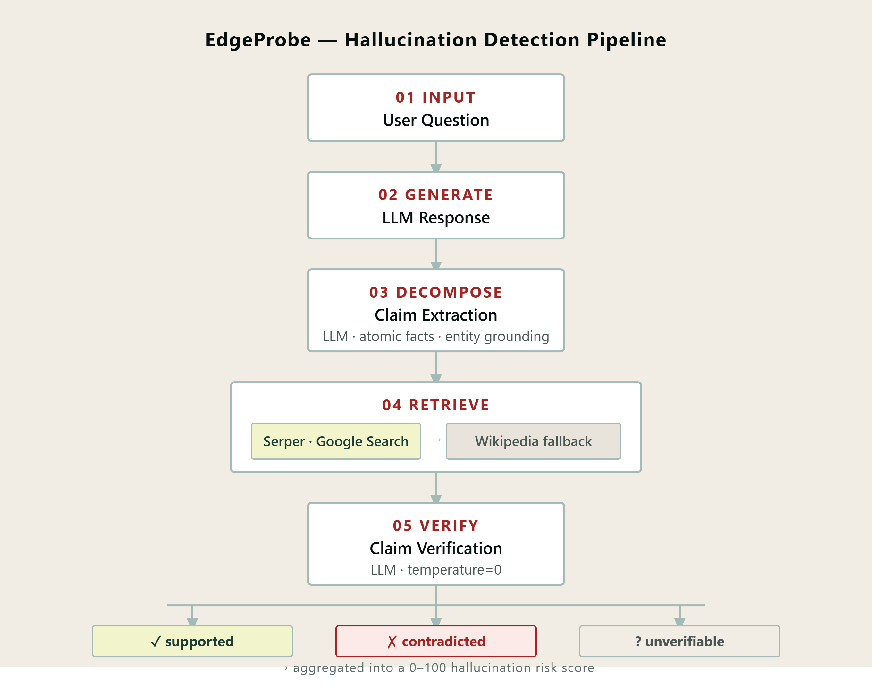
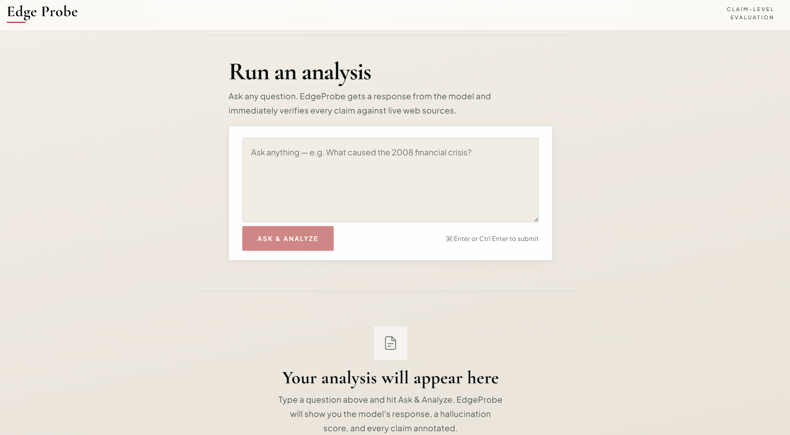
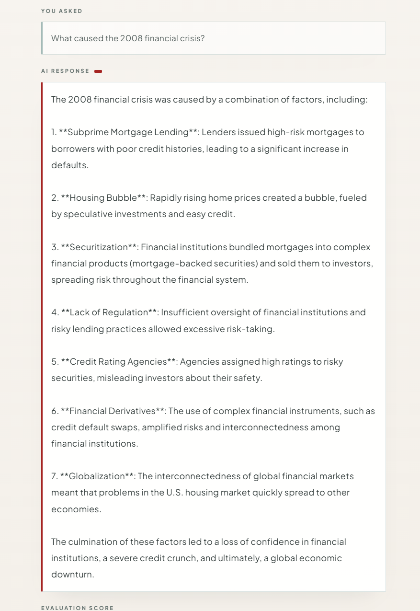
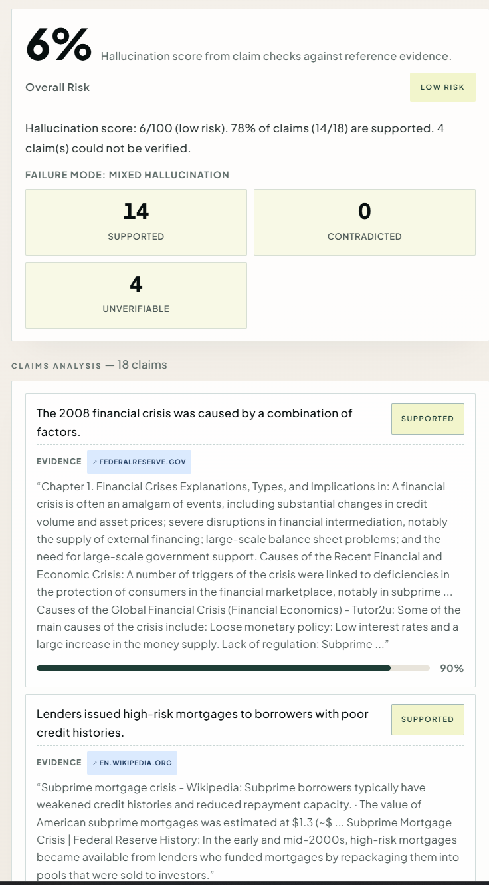

# EdgeProbe

**Claim-level hallucination detection for LLM responses.**

EdgeProbe breaks an AI response into individual, verifiable facts — then checks each one against live web sources and returns a structured verdict. Instead of asking *"is this response good?"*, it asks *"which specific claims are supported, which are wrong, and which can't be verified?"*

**Live Demo:** https://your-netlify-url.netlify.app

---

## The core idea

Most AI evaluation tools treat a response as a single blob of text and hand back a score. That tells you very little.

EdgeProbe takes a different approach, grounded in research from [FActScore (Min et al., EMNLP 2023)](https://arxiv.org/abs/2305.14251), [SAFE (Wei et al., NeurIPS 2024)](https://arxiv.org/abs/2403.18802), and [SelfCheckGPT (Manakul et al., EMNLP 2023)](https://arxiv.org/abs/2303.08896):

```
Question → LLM Response → Atomic Claims → Web Evidence → Verdict per Claim → Risk Score
```

Every claim in a response gets its own verdict. You can see exactly where the model got things right, where it hallucinated, and where the evidence simply doesn't exist.

---

## How it works




**1. You ask a question**  
Type anything into the interface. EdgeProbe sends it to the LLM and captures the response.

**2. Claim extraction**  
An LLM decomposes the response into atomic factual claims — not sentence splits, but semantically complete statements with all entity references resolved. *"He proposed the idea"* becomes *"Albert Einstein proposed the idea of using rockets in 1917."*

**3. Evidence retrieval**  
Each claim is searched against live web sources via the Serper API (Google Search). EdgeProbe pulls structured evidence from answer boxes, knowledge graphs, and top organic results — with Wikipedia as a fallback when web search isn't available.

**4. Claim verification**  
A second LLM call classifies each claim against the retrieved evidence at `temperature=0` for deterministic outputs:

| Verdict | Meaning |
|---|---|
| `supported` | Evidence confirms the claim |
| `contradicted` | Evidence directly conflicts with the claim |
| `unverifiable` | No usable evidence found either way |

**5. Risk scoring**  
Claims are weighted by their verdict — contradictions carry far more penalty than unverifiable claims — and aggregated into a 0–100 hallucination score with a `low / medium / high` risk level. Any contradicted claim forces the risk level to at least `high`.

```
supported     → weight 0   (no penalty)
unverifiable  → weight 1   (mild — absence of evidence ≠ evidence of absence)
contradicted  → weight 4   (severe — claim actively conflicts with evidence)

hallucination_score = (raw_penalty / max_penalty) × 100
```

---

## Example





---

## Tech stack

| Layer | Stack |
|---|---|
| Backend | FastAPI · Python · PostgreSQL · SQLAlchemy |
| LLM | OpenAI `gpt-4o-mini` |
| Evidence retrieval | Serper API (Google Search) · Wikipedia fallback |
| Frontend | React · Vite (single-file, inline styles) |
| Hosting | Render (backend + DB) · Vite dev server (frontend) |

---

## Features

- **Direct question input** — ask any question; no pre-generated prompts required
- **LLM-based claim extraction** — coreference resolution, entity grounding, no sentence fragments
- **Live web search** — Serper API pulls real-time Google results, not just static Wikipedia
- **Source attribution** — every claim links back to the page it was verified against
- **Weighted risk scoring** — contradictions penalised 4× harder than unverifiable claims
- **Adversarial prompt library** — generate edge-case prompts by domain and failure category (ambiguity, near-fact, misleading context, multi-hop)
- **Deterministic verification** — `temperature=0` for reproducible verdicts

---

## Research grounding

EdgeProbe's pipeline is directly informed by three papers:

**FActScore** (Min et al., EMNLP 2023) introduced atomic fact decomposition — the same claim-level granularity EdgeProbe uses. Their key finding: paragraph-level evaluation masks the fact that LLMs are often *partially* correct, and granularity reveals exactly where and how models fail.

**SAFE** (Wei et al., NeurIPS 2024) extended this with multi-step Google Search per claim and an F1-based metric that balances precision and recall across supported facts. EdgeProbe adopts the web-search retrieval approach from SAFE.

**SelfCheckGPT** (Manakul et al., EMNLP 2023) showed that hallucinations can be detected by sampling the same prompt multiple times and checking for consistency — without needing any external reference. This informed the scoring philosophy: inconsistency is a signal, not just a mismatch with a fixed source.

---

## What's next

- [ ] Multi-hop claim resolution (decompose complex claims before searching)
- [ ] Sampling-based consistency check (SelfCheckGPT-style) alongside retrieval
- [ ] F1 metric over supported facts (FActScore-compatible)
- [ ] Confidence calibration across retrieval + verification steps
- [ ] Side-by-side model comparison (same question, two models, compare scores)
- [ ] Caching layer for repeated claim lookups

---

## Why this matters

Hallucination is one of the hardest unsolved problems in deploying LLMs reliably. EdgeProbe doesn't try to prevent hallucinations at generation time — it catches them after the fact, at the granularity where they actually live: individual claims.

> Not just generating answers — but knowing which ones to trust.

---

*Built by [Aparna Burhade](https://github.com/aparnaburhade)*
